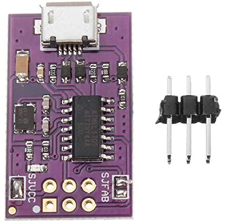

<h3 align="center">CM3 Panel 7 POE - ACME Systems Industrial computer module display</h3>

  

### Examples programming ATTiny microcontroller from command line ( Raspbian OS )

Required install avrdude. The programming of the microcontroller can be performed directly from the CM3 Panel POE microprocessor board through the serial port, using a TTL 3V3 serial adapter.

Ex: <h4>sudo apt-get install avrdude</h4>

### Flash Optiboot bootloader width Atmel ICE
$ sudo avrdude -Cavrdude.conf -v -pattiny88 -catmelice_isp -Pusb -e -Uefuse:w:0xfe:m -Uhfuse:w:0b11010111:m -Ulfuse:w:0xE2:m -Uflash:w:optiboot_attiny88_8000000L.hex:i 

### Programming Bootloader with USBTiny
$ sudo avrdude -Cavrdude.conf -v -pattiny88 -cusbtiny -e -Uefuse:w:0xfe:m -Uhfuse:w:0b11010111:m -Ulfuse:w:0xE2:m -Uflash:w:optiboot_attiny88_8000000L.hex:i 

### Programming PowerSafe with USBTiny
$ sudo avrdude -Cavrdude.conf -v -pattiny88 -cusbtiny -e -Uefuse:w:0xfe:m -Uhfuse:w:0b11010111:m -Ulfuse:w:0xE2:m -Uflash:w:CM3POE7_12.9.hex:i

### Programming PowerSafe with USB serial port adapter
$ sudo avrdude -Cavrdude.conf -v -pattiny88 -carduino -P/dev/ttyUSB0 -b19200 -D -Uflash:w:CM3POE7_12.9.hex:i

### Steps ATTiny programming ( Source 12.9 directory )

1. Remove jumper SJVCC on USBTiny

    

2. Connect the USBTiny adapter to PC and connect on ICSP port board
3. Power on Board
4. Lanch the command ./flash_bootloader.sh
5. Now the boot loader is programmed
6. Connect USB serial adapter to PC or USB port CM3 Panel ( Serial port. Ex: /tty/USBO or COM1 )
7. Connect serial USB adapter on EXP2 pin connector
8. Press and hold the button Reset MicroP P3
9. Lanch the command ./flash_powersafe.sh and release immediately the button Reset MicroP P3

At the end of the programming, the RGB LED on the board will indicate the operating mode and the state of charge of the supercapacitor.

## Notes

The communication on the correct functioning of the Power Safe, between the CM3 Panel and the ATTiny microcontroller takes place through 2 GPIOs, GPIO 25 is used by the ATTiny to notify the microprocessor to carry out the shutdown (LOW), while the GPIO26 (status HIGH) communicates to the ATTiny that it shutdown occurred regularly, consequently ATTiny deactivates the board power supply.

