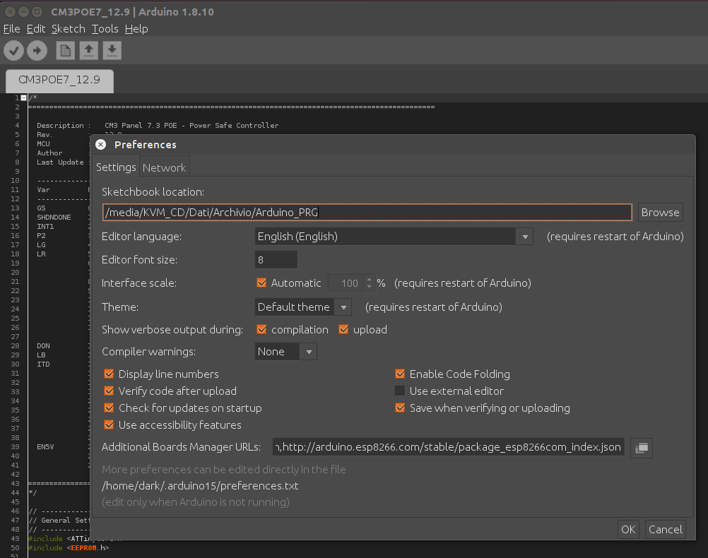
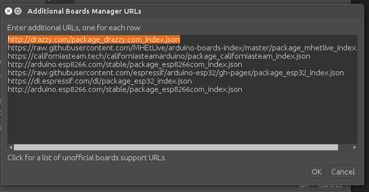
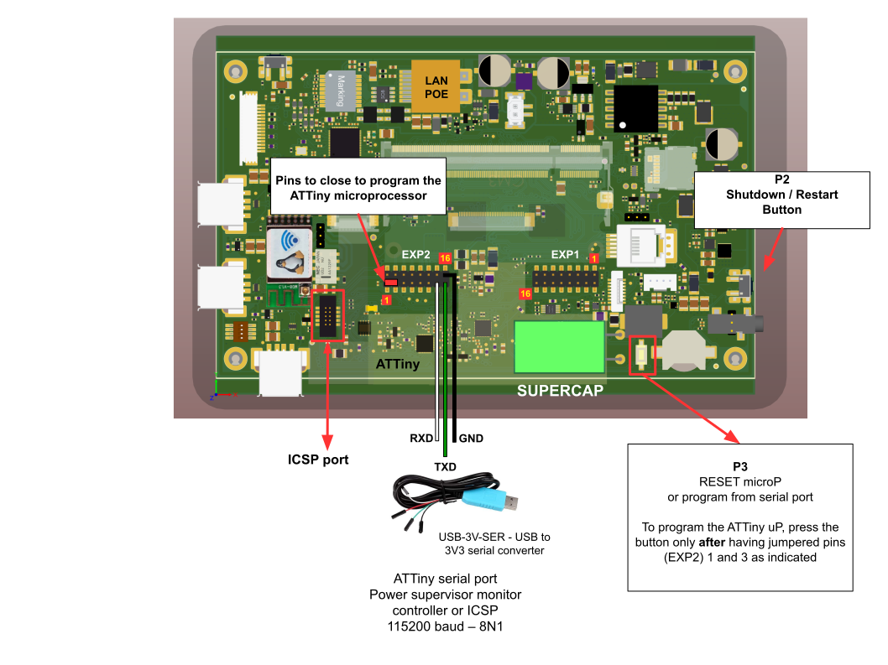

<h3 align="center">ATTiny programming example with Arduino IDE</h3>

Setting chip, File -> Preferences

    

    

Install Tools -> Board Manager the "ATTinyCore SpenceKonde".

Set menu Tools -> Board, setting ATtiny 48/88 (Optiboot) and clock source 8Mhz internal.

    

### ATTiny programming sequence with Arduino IDE

1. Board active, insert jumper BYPASS on Board and connect the serial port adapter to Pc.
2. Connect serial USB adapter on EXP2 pin connector to serial pin.
3. Press and hold the button Reset MicroP P3
4. Lanch the command to flash ATTiny and release immediately the button Reset MicroP P3
5. Remove jumper BYPASS on Board.

At the end of the programming, the RGB LED on the board will indicate the operating mode and the state of charge of the supercapacitor.

During programming, the display of the board turns off because it is controlled by the microcontroller. The data on the board status and the voltages in mV of all the board power supply stages are sent by the microcontroller on the debug serial port of the IDE.

### The serial communication parameters are as follows:

Speed           : 19200 baudrate
Parity          : none
Bits            : 8
Stopbits        : 1
Flow control    : none

