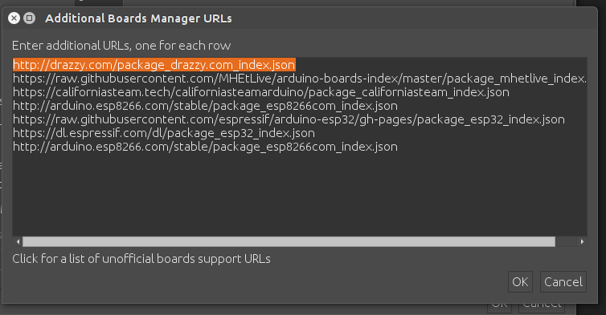

<h3 align="center">ATTiny programming example with Arduino IDE</h3>

Setting chip, File -> Preferences

    

    

Tools -> Board, setting ATtiny 48/88 (Optiboot) and clock source 8Mhz internal.

    

### ATTiny programming sequence with Arduino IDE

1. Board active, insert jumper BYPASS on Board and connect the serial port adapter to Pc.
2. Connect serial USB adapter on EXP2 pin connector to serial pin.
3. Press and hold the button Reset MicroP P3
4. Lanch the command to flash ATTiny and release immediately the button Reset MicroP P3

At the end of the programming, the RGB LED on the board will indicate the operating mode and the state of charge of the supercapacitor.
